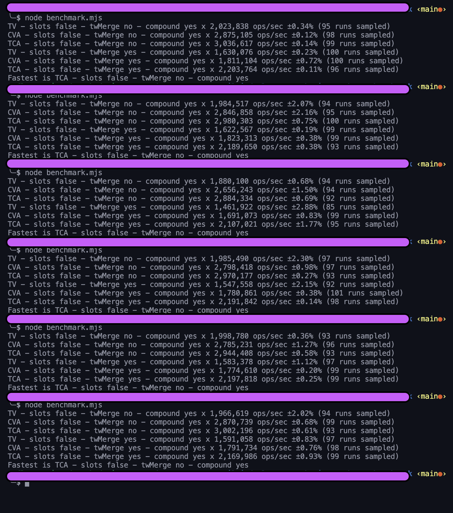

# Benchmarks

We do compare our library against `cva` amd `tailwind-variants`

To run them:

`pnpm install`

inside core folder:
`pnpm build`

come back to benchmark folder and run
`node benchmarks.mjs`

## Test

`pnpm test`
To make sure we do have the same outputs between library

## Our current benchmarks. TCA is our library At this time we had another name 

